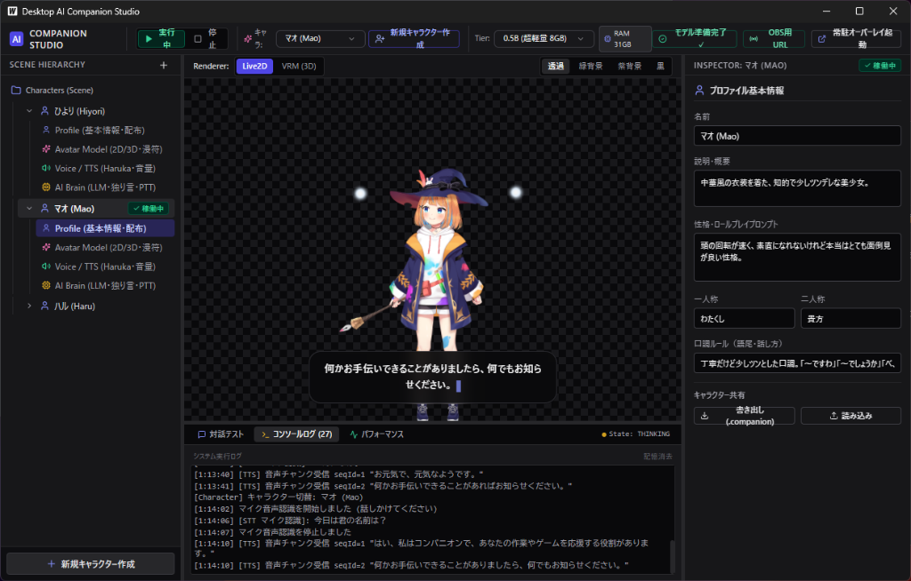
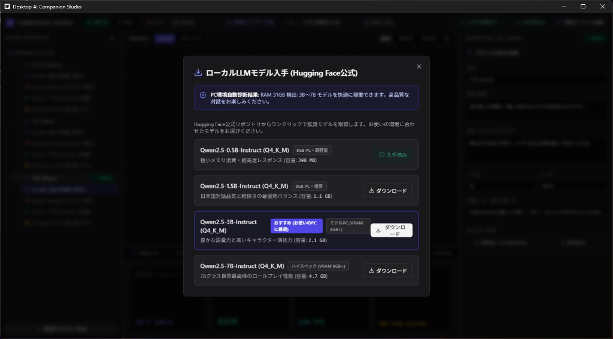

# 🤖 AI Companion Studio (Desktop AI Companion)

[](https://go.dev/)
[](https://wails.io/)
[](https://reactjs.org/)
[](LICENSE)

完全ローカル環境で動作する、プライバシー保護型の次世代デスクトップAIコンパニオン・スタジオです。  
クラウドAPIに依存せず、PCローカル上で高速LLM推論（llama.cpp）、音声認識（STT）、音声合成（TTS）、Live2D/VRMアバター描画、および会話長期記憶（Pure-Go SQLite + ベクトル検索）がすべて完結します。

---

## 📸 スクリーンショット (Screenshots)

### 🎨 Godot Engine 風 AI Companion Studio
Live2D / VRM アバターの自由操作（右ドラッグ移動・ホイールズーム）、LINE/Discord風リッチチャット、手動モデル動作テストコントローラー、およびパフォーマンスモニターを完備。



### 📦 厳選ローカルLLMモデル・ダウンローダー
Google Gemma 2、Meta Llama 3.2、Qwen 2.5、Phi-3.5 などの軽量・高性能GGUFモデルをワンクリックでダウンロード・自動起動。PCスペックに応じた推奨モデルを自動診断。



---

## ✨ 主な特徴 (Key Features)

- **🔒 100% 完全ローカル完結・プライバシー保護**:
  - 会話内容や音声データは外部サーバーへ一切送信されず、完全にPC内で完結します。
- **🎮 ゲームエンジン風 スタジオUI (Godot/Unity Style)**:
  - **SceneTree (左ペイン)**: キャラクター階層、コンポーネントツリー、右クリックコンテキストメニュー（召喚・複製・書き出し・削除）。
  - **Viewport (中央ペイン)**: Live2D / 3D VRMレンダラー切替、右ドラッグ位置移動、ホイールズーム（50%〜250%）、位置リセット、感情漫符オーバーレイ。
  - **Inspector (右ペイン)**: キャラクター性格・一人称/二人称・口調設定、TTS設定、手動モデル動作テスト（口開度・視線左右・表情プレビュー）。
  - **BottomPanel (下部ペイン)**: 吹き出しチャット履歴、音声ワンクリック再読み上げ（Replay）、プッシュ・トゥ・トーク（PTT: Space長押し）、コンソールログ、リアルタイム推論速度（Tok/s）計測。
- **⚡ 超低遅延ストリーミング対話パイプライン**:
  - LLMのストリーミング出力をリアルタイムに句分割（Sentence Splitter）し、最初の1文が生成された瞬間に音声合成を開始（初声遅延 1秒未満）。
- **🛡️ 堅牢な外部プロセス管理 (Windows Job Object)**:
  - `llama-server.exe` などの推論プロセスを Windows Job Object に登録。親プロセスの終了やクラッシュ時も子プロセスの孤立（ゾンビ化）やポート衝突を完全根絶。
  - GPUオフロード（`-ngl 99`）に標準対応し、圧倒的な推論速度を実現。
- **🧠 ハイブリッド記憶システム (SQLite + インメモリベクトル検索)**:
  - Cgo（外部Cコンパイラ）を一切要求しない Pure-Go SQLite を採用。
  - 会話の要約記憶とコサイン類似度ベクトル検索により、過去の会話文脈を自然に引き継ぎ。
- **🪟 デスクトップ常駐オーバーレイモード**:
  - 最前面透過ウィンドウ（クリック透過対応）により、PC作業中やゲーム中もデスクトップ上にアバターが常駐し、自発的に息抜きや応援の声をかけます。

---

## 🏗️ システムアーキテクチャ (Architecture)

```mermaid
flowchart TB
    subgraph Frontend["フロントエンド (React 18 + Vite 6 + Tailwind CSS)"]
        UI[Studio UI / SceneTree / Inspector]
        VP[Viewport (Live2D PixiJS / Three.js VRM)]
        Audio[AudioService (Web Audio API)]
        STT[SpeechService (Web Speech API / PTT)]
    end

    subgraph Backend["バックエンド (Go 1.24 + Wails v2)"]
        Pipeline[対話オーケストレーター (Pipeline)]
        Splitter[句分割エンジン (Sentence Splitter)]
        ProcessMgr[プロセス管理者 (Windows Job Object)]
        MemStore[記憶エンジン (Pure-Go SQLite)]
    end

    subgraph External["外部推論エンジン (Local Engine)"]
        LLMServer["llama-server.exe (GGUF / GPUオフロード)"]
        TTS["Windows SAPI / VOICEVOX / SBV2"]
    end

    UI -->|Wails IPC| Pipeline
    STT -->|音声テキスト| Pipeline
    Pipeline -->|/completion| LLMServer
    LLMServer -->|トークン逐次返却| Splitter
    Splitter -->|句単位合成| TTS
    TTS -->|音声チャンク| Audio
    Audio -->|リップシンク・感情| VP
    ProcessMgr -.->|死活監視・強制終了| LLMServer
```

---

## 💻 動作環境 (System Requirements)

- **OS**: Windows 10 / 11 (64-bit)
- **CPU**: Intel Core i5 / AMD Ryzen 5 以上
- **メモリ**: 8GB RAM 以上 (16GB 以上を推奨)
- **GPU (推奨)**: NVIDIA GeForce (CUDA) または AMD Radeon
- **開発ツール (ビルド時)**:
  - Go 1.24+
  - Node.js 18+ (LTS)
  - Wails v2 (`go install github.com/wailsapp/wails/v2/cmd/wails@latest`)

---

## 🚀 ビルド ＆ 起動方法 (Quick Start)

### 1. リポジトリのクローン
```bash
git clone https://github.com/sofia-gros/aicompanion.git
cd aicompanion
```

### 2. 依存関係のインストール
```bash
# フロントエンド依存ライブラリのインストール
cd frontend
npm install
cd ..
```

### 3. ビルド
```bash
wails build
```
ビルドが完了すると、`build/bin/aicompanion.exe` が生成されます。

### 4. 起動
```powershell
.\build\bin\aicompanion.exe
```

---

## 📖 使い方 (Usage Guide)

1. **モデルの準備**:
   - アプリ起動後、上部ツールバーの **「モデル入手」** をクリックします。
   - お使いのPCスペックに合わせた推奨モデル（例: Qwen 2.5 0.5B / 1.5B、Google Gemma 2 2B など）をワンクリックでダウンロードできます。
2. **キャラクターのカスタマイズ**:
   - 左側の **SceneTree** からキャラクター（ひより、アカリ、ルミなど）を選択します。
   - 右側の **Inspector** で名前、一人称、二人称、口調、TTS音声エンジン（Windows標準 Haruka / VOICEVOXなど）を自由に設定できます。
3. **対話テスト**:
   - 下部の **「対話テスト」** タブでメッセージを入力して送信、またはマイクボタンで音声対話を行います。
   - **プッシュ・トゥ・トーク (PTT)** を有効にすると、`Space` キーを押している間だけマイクが有効になり、離すと即時送信されます。
   - キャラクターの過去の発言横にある **「🔊」** ボタンを押すと、いつでも音声を再再生できます。
4. **常駐モード**:
   - ツールバーの **「常駐オーバーレイ起動」** をクリックすると、独立した透過ウィンドウで画面の隅にアバターを常駐させることができます。

---

## 📜 ライセンス (License)

本プロジェクトは [MIT License](LICENSE) のもとで公開されています。

---

## 🙏 謝辞 (Credits)

- [llama.cpp](https://github.com/ggml-org/llama.cpp) by Georgi Gerganov
- [Wails](https://wails.io/) by Lea Anthony
- [PixiJS](https://pixijs.com/) & [pixi-live2d-display](https://github.com/guansss/pixi-live2d-display)
- [three-vrm](https://github.com/pixiv/three-vrm) by Pixiv Inc.
