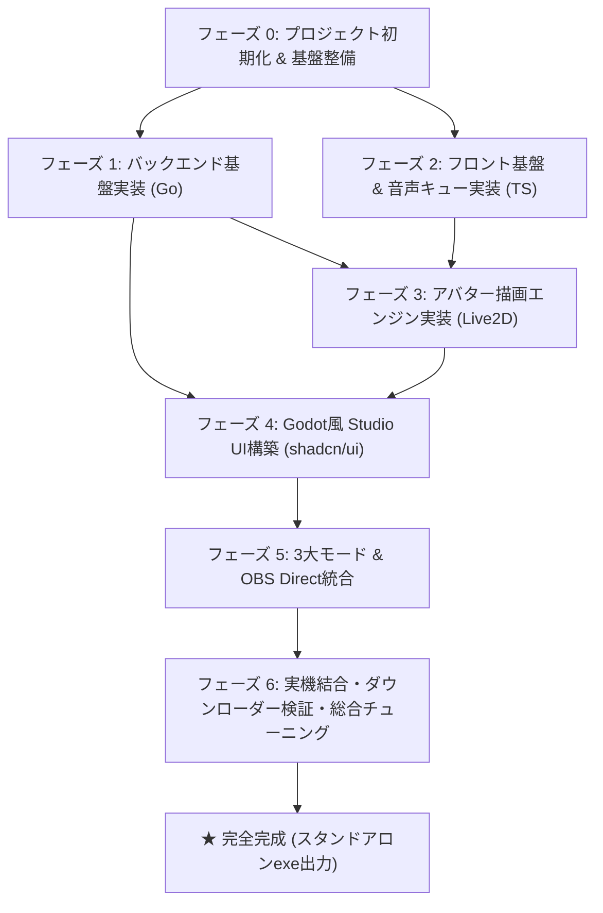

# AIコンパニオン完成までの全実装タスク詳細書 (Master Task Breakdown)

本ドキュメントは、デスクトップ常駐型AIコンパニオンシステムを、**一切のバグや手戻りなくゼロから完成まで導くための全作業工程・依存関係・検証基準** を詳細に定義したものです。
ホストPC環境（RAM 8GB）に配慮し、大規模モデルの実機推論によるメモリ枯渇を防止しつつ、**ワンクリックダウンローダー** と **内蔵Mockモード** を駆使して極めて安全・軽快に開発を完了させます。

---

## 全体ロードマップ・依存関係図

---

## フェーズ 0: プロジェクトスキャフォールディング ＆ ツールチェーン初期化

- [ ] **0.1 Wails プロジェクト構成のセットアップ**:
  - `wails.json` の作成（透過・フレームレス設定、Windows固有フラグ指定）。
  - `main.go`, `app.go` の初期エントリーポイント作成。
- [ ] **0.2 Go 依存ライブラリの解決 (`go.mod`)**:
  - `modernc.org/sqlite` (Pure-Go SQLite)
  - `github.com/gorilla/websocket` (OBS配信用)
  - `golang.org/x/sys/windows` (Job Object / マウス透過用)
  - `github.com/wailsapp/wails/v2`
- [ ] **0.3 フロントエンド基盤の構築 (`frontend/`)**:
  - Vite + React 19/18 + TypeScript プロジェクト初期化。
  - `package.json` 依存関係のインストール（shadcn/ui, tailwindcss, pixi.js@^7.4.2, pixi-live2d-display, zustand, react-resizable-panels）。
  - `components.json` および Tailwind CSS 設定。
- [ ] **0.4 静的アセット＆GBNF文法ファイルの配置**:
  - `bin/grammars/no_emoji.gbnf` の作成（絵文字排除文法）。
  - `frontend/public/live2d/live2dcubismcore.min.js` の配置。
  - テスト用Live2Dサンプルモデルアセットの配置（`frontend/public/live2d/models/`）。

---

## フェーズ 1: バックエンド基盤実装 (Go Orchestrator)

- [ ] **1.1 プロセス管理実装 (`pkg/process/`)**:
  - `job_windows.go`: Windows Job Object API (`JOB_OBJECT_LIMIT_KILL_ON_JOB_CLOSE`) による子プロセス自動連動強制終了の実装。
  - `manager.go`: `llama-server.exe` の起動、引数構築、死活監視ループ、Graceful Shutdown。
- [ ] **1.2 ワンクリック・モデルダウンローダー実装 (`pkg/downloader/`)**:
  - `client.go`: レジューム対応のHTTPダウンロードエンジン。
  - `progress.go`: 転送速度、残り秒数、パーセントの算出と Wails Event (`download-progress`) へのリアルタイム送出。
- [ ] **1.3 プラガブル音声合成層実装 (`pkg/tts/`)**:
  - `provider.go`: `TTSProvider` インターフェースおよび `AudioResult`, `TTSOptions` 定義。
  - `voicevox.go`: VOICEVOX (ポート `50021`) アダプター。
  - `stylebertvits2.go`: Style-Bert-VITS2 (ポート `5000`) アダプター。
  - `mock.go`: 外部サーバーなしでダミーWAV音声を即時生成する安全なテスト用モックプロバイダー。
- [ ] **1.4 会話ストリーミング ＆ リアルタイム句分割 (`pkg/pipeline/`)**:
  - `splitter.go`: 句読点（`。！？\n`）によるリアルタイム句分割バッファ。
  - `dialogue.go`: プロンプト構築、llama-server への SSE ストリーミング接続、非同期並列TTSリクエスト投入、`seqId` 付与。
- [ ] **1.5 OBS Direct ローカルサーバー (`pkg/server/`)**:
  - `http_server.go`: ポート `18923` で静的アバターHTML（`avatar.html`）を配信するHTTPサーバー。
  - `ws_hub.go`: OBSクライアントへ `avatar-speak` イベントを一斉ブロードキャストするWebSocketハブ。
- [ ] **1.6 LLM Tier管理 ＆ プロンプト生成 (`pkg/llm/`)**:
  - `tier_manager.go`: 0.5B / 1.5B / 3B / 7B / Cloud の設定プリセット管理。
  - `prompt_builder.go`: ChatML形式プロンプト構築、Few-Shotセリフ例の注入、キャラ口調固定。
- [ ] **1.7 記憶管理実装 (`pkg/memory/`)**:
  - `db.go`: Pure-Go SQLite 接続、WALモード有効化、テーブル自動マイグレーション。
  - `short_term.go`: 直近会話ログの追加・取得・ターン数制御。
  - `vector.go`: Go並列コサイン類似度計算関数。
  - `long_term.go`: 過去ログの自動要約トリガーおよび類似記憶検索。
- [ ] **1.8 Windows プラットフォーム固有制御 (`pkg/platform/`)**:
  - `window_windows.go`: `SetClickThrough` による `WS_EX_TRANSPARENT` のトグル。
- [ ] **1.9 Wails RPC バインディング (`app.go`, `main.go`)**:
  - ダウンローダーRPC（`StartModelDownload`, `CancelModelDownload`, `GetAvailableModels`）を含む全11メソッドの実装。

---

## フェーズ 2: フロントエンド基盤 ＆ 音声・リップシンク実装

- [ ] **2.1 型定義・Wails Bridge構築**:
  - `src/types/events.ts`: `AvatarSpeakPayload`, `DownloadProgressPayload`, `SystemConfig` 等の完全定義。
  - `src/services/wailsBridge.ts`: Wails Events 受信・RPC呼び出しのラッパー。
- [ ] **2.2 音声再生キューエンジン実装 (`src/services/audioService.ts`)**:
  - Web Audio API (`AudioContext`) を初期化。
  - `pushChunk` による `seqId` 順ソートとギャップレス連続再生。
  - `getMouthOpen`: `AnalyserNode` の周波数データからRMS口開度（0.0〜1.0）の平滑化算出。
- [ ] **2.3 グローバル状態管理 (`src/stores/useAppStore.ts`)**:
  - Zustand による対話ステート、全設定パラメータ、ダウンロード進捗の統合管理。

---

## フェーズ 3: アバター描画エンジン実装 (Live2D & VRM)

- [ ] **3.1 Live2D キャンバスコンポーネント (`src/components/avatar/Live2DCanvas.tsx`)**:
  - PixiJS v7 Application 初期化（背景完全透明）。
  - `Live2DModel.from()` によるモデル読み込み。
  - Ticker ループでのリップシンク（`ParamMouthOpenY`）およびマウス視線追従のフレーム反映。
  - 感情タグに応じた表情切り替え。
- [ ] **3.2 VRM 互換キャンバス (`src/components/avatar/VRMCanvas.tsx`)**:
  - Three.js + @pixiv/three-vrm による3Dモデル描画（将来拡張用）。
- [ ] **3.3 字幕コンポーネント (`src/components/avatar/Subtitle.tsx`)**:
  - アニメーション付きテキスト吹き出し。
- [ ] **3.4 独立アバター/OBSビューポート画面 (`src/AvatarApp.tsx`, `avatar.html`)**:
  - OBS Direct およびセカンダリビューポート専用の自律描画画面。

---

## フェーズ 4: Godot Engine 風 Studio UI の構築 (shadcn/ui)

- [ ] **4.1 shadcn/ui コンポーネント群のセットアップ**:
  - `Button`, `Slider`, `Switch`, `Tabs`, `Accordion`, `ScrollArea`, `Select`, `Dialog`, `Progress` 等の導入。
- [ ] **4.2 4ペインレイアウトの構築 (`src/App.tsx`)**:
  - `react-resizable-panels` によるドラッグ分割画面。
- [ ] **4.3 各ペインコンポーネントの実装**:
  - **Toolbar (`Toolbar.tsx`)**: 実行/停止、常駐切替、OBS用URLコピー、**モデル入手ボタン**。
  - **SceneTree (`SceneTree.tsx`)**: ノードヒエラルキー。
  - **Viewport (`Viewport.tsx`)**: Live2Dリアルタイム描画、背景色切替（透過/緑/紫/黒）、リップシンクメーター。
  - **Inspector (`Inspector.tsx`)**: スライダーによる感度・音量・温度・GPUレイヤー数の即時調整。
  - **BottomPanel (`BottomPanel.tsx`)**: デバッグ対話テストチャット、Token/sec & Latencyモニター、システムログ。
  - **ModelDownloaderModal (`ModelDownloaderModal.tsx`)**: ワンクリックGGUFダウンロードダイアログ。

---

## フェーズ 5: 3大モード ＆ OBS Direct統合

- [ ] **5.1 モード切替機構の結合**: Studio Mode ↔ Companion Overlay のシームレス切替。
- [ ] **5.2 マウス透過（Click-Through）の動作検証**: キャラ外クリック時の背面アプリ操作確認。
- [ ] **5.3 OBS Direct ブラウザソース連携の検証**: OBS Studio から `http://localhost:18923/avatar` を読み込み、**完全アルファ透過・緑フリンジ皆無** でリアルタイム合成されることを確認。

---

## フェーズ 6: 実機結合・ダウンローダー検証・総合チューニング

- [ ] **6.1 ダウンローダー実機動作確認**:
  - UIから `Qwen2.5-0.5B` または `1.5B` のワンクリックダウンロードを実行し、進捗バー・レジューム機能・完了後の自動認識を検証。
- [ ] **6.2 超軽量モデル (0.5B/1.5B) または Mockモードでのストリーミング検証**:
  - 8GB RAMを安全に維持した状態での会話ストリーミング、GBNF絵文字排除、Context-Shift動作確認。
- [ ] **6.3 音声合成（VOICEVOX / Mock）結合**:
  - 発話開始遅延（First-Audio-Latency < 800ms）の確認。
- [ ] **6.4 ゾンビプロセスゼロ＆GPU負荷検証**:
  - 親プロセス強制終了時の連動終了確認、Live2Dの超低GPU負荷（数%）確認。
- [ ] **6.5 プロダクションバイナリビルド**:
  - `wails build` による単一実行可能ファイル（`aicompanion.exe`）の生成。
