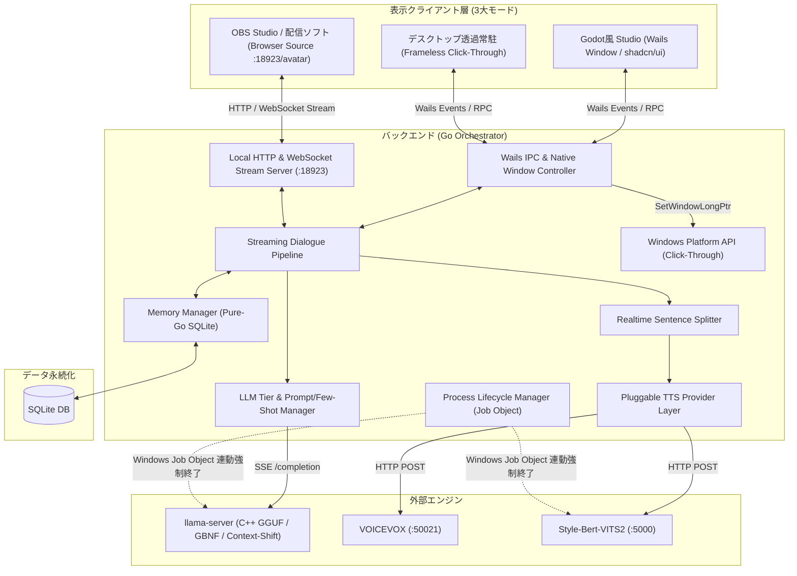
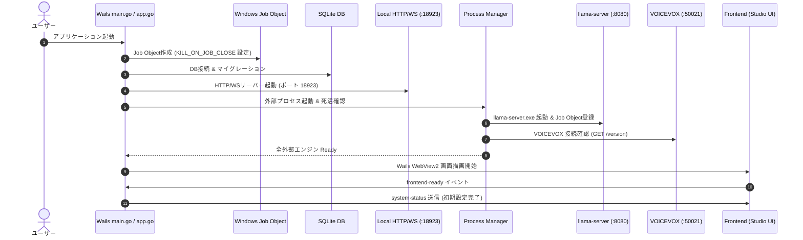
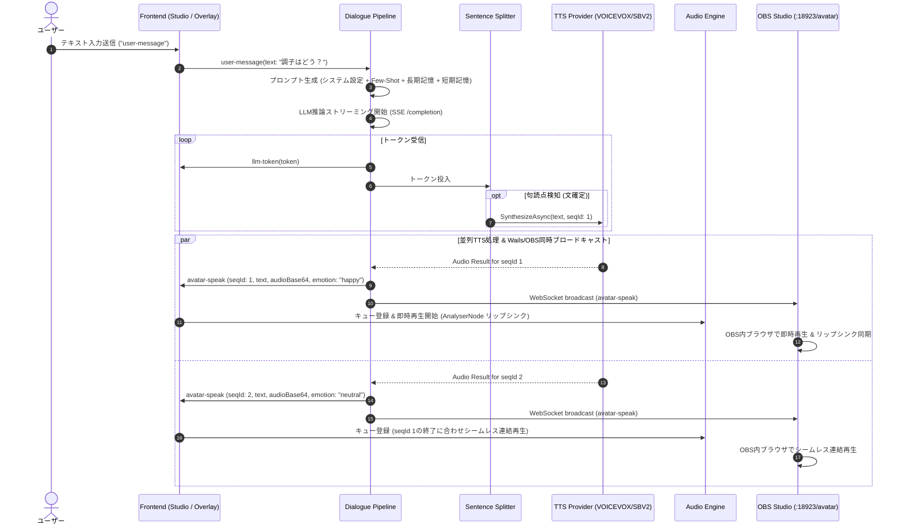

# 全体設計書: デスクトップAIコンパニオン システムアーキテクチャ

## 1. システム全体構成

本システムは、**Godot Engine風スタジオエディタ（shadcn/ui）**、**デスクトップ透過常駐オーバーレイ**、および **OBS Directブラウザソース（100%透過配信）** の3形態を同一のGoバックエンドからシームレスに提供するハイブリッドアーキテクチャを採用する。
アバターレンダラーは、GPU負荷が極小でNeurosama風の愛嬌を持つ **Live2D をプライマリ（本命）** とし、将来的なVRM 3Dにも対応可能な構造とする。



---

## 2. 3大表示モードの仕組み

| モード | ウィンドウ形態 | 用途 | 特徴 |
| :--- | :--- | :--- | :--- |
| **Studio Mode** | 通常デスクトップウィンドウ (1280x800等) | 設定・調整・対話テスト・デバッグ | Godot風4ペインUI。インスペクターで全設定をリアルタイム変更 |
| **Companion Overlay** | フレームレス透過ウィンドウ (450x700等) | 日常のデスクトップ常駐 | キャラ外クリック透過（`WS_EX_TRANSPARENT`）、ドラッグ移動 |
| **OBS Direct Browser Source** | OBS内蔵ブラウザソース (`http://localhost:18923/avatar`) | ゲーム配信・雑談配信・VTuber共演 | **緑背景不要の100%アルファ透過**。緑フリンジ皆無、OBSキャプチャGPU負荷最小 |

---

## 3. シーケンス詳細仕様

### 3.1 起動シーケンス (Application Startup)


### 3.2 対話ストリーミングシーケンス (Interactive Streaming)


---

## 4. 通信プロトコル仕様 (Wails Events ＆ RPC)

### 4.1 Wails Events 仕様
| イベント名 | 送信方向 | ペイロード型 | 説明 |
| :--- | :--- | :--- | :--- |
| `user-message` | FE ➔ BE | `{ "text": string }` | ユーザーのテキスト発言 |
| `llm-token` | BE ➔ FE | `{ "token": string, "isFirst": boolean }` | 画面へのリアルタイム文字表示用トークン |
| `avatar-speak` | BE ➔ FE & WS | `AvatarSpeakPayload` | 音声再生バイナリ、順序番号、感情、テキスト |
| `playback-state` | FE ➔ BE | `{ "state": "idle" \| "playing" }` | フロントエンドの音声再生ステータス |
| `system-status` | BE ➔ FE | `{ "llmReady": boolean, "ttsReady": boolean, "activeTTS": string, "activeTier": string }` | バックエンド初期化状態 |

#### `AvatarSpeakPayload` 型定義
```json
{
  "seqId": 1,
  "isLast": false,
  "text": "こんにちはなのだ！",
  "audioFormat": "audio/wav",
  "audioBase64": "UklGRi...",
  "emotion": "happy",
  "durationMs": 1200
}
```

### 4.2 Go バインディング RPC仕様 (`app.go`)
| メソッド名 | 引数 | 戻り値 | 説明 |
| :--- | :--- | :--- | :--- |
| `SwitchDisplayMode` | `mode string` (`"studio"` / `"overlay"`) | `error` | スタジオ画面と常駐オーバーレイ画面の切り替え |
| `SetClickThrough` | `enabled bool` | `error` | マウス透過（`WS_EX_TRANSPARENT`）の切り替え |
| `SetLLMPreset` | `tier string` (`"tier1"` / `"tier2"` / `"tier3"` / `"cloud"`) | `error` | スペック別LLMプリセットの切り替え |
| `SetTTSProvider` | `engine string, speakerID int` | `error` | 音声エンジン（`"voicevox"` / `"style-bert-vits2"`）と話者の変更 |
| `GetSystemConfig` | なし | `SystemConfig` | 現在の全設定情報の取得 |
| `UpdateSystemConfig` | `cfg SystemConfig` | `error` | 設定の更新とDB永続化 |
| `ClearConversationHistory` | なし | `error` | 短期会話ログの消去 |
| `SetLive2DParameter` | `param string, value float64` | `error` | インスペクターからの手動パラメータテスト注入 |
